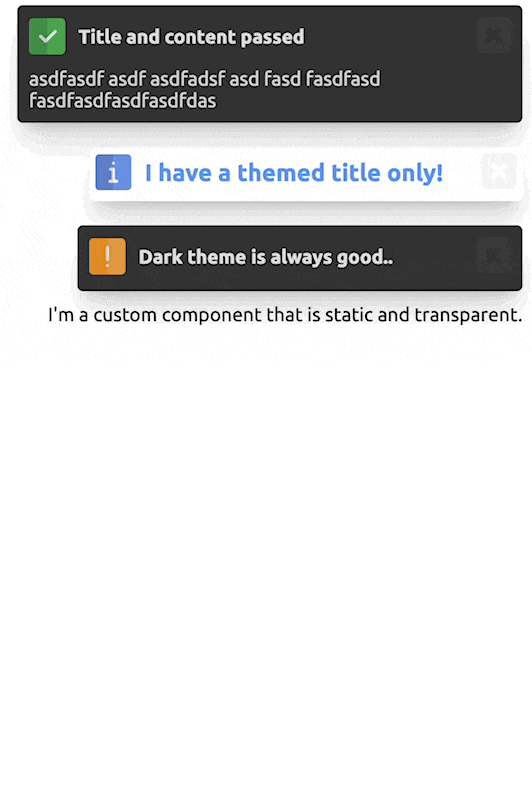
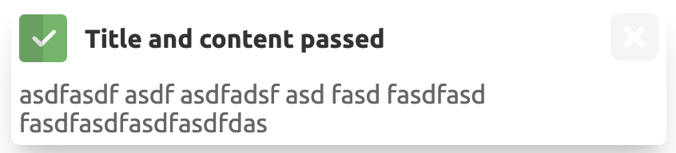
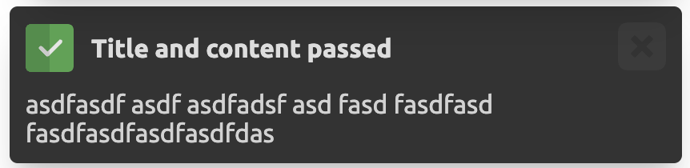

# 🚀 Angular toaster notifications like a boss.



# ⚡ Features

* Zero dependencies (no fontpack for icons, no jQuery, no nothing!)
* One line of code to show a notification. 🙏
* Interactive pause and resume support.
* Bring-your-own-component support (100% customization support). 💣
* No module import required, just add the component to your app root.
* Complete control over styling with theme support.
* Hackable and extensible. 🧰

# 🛴 Installation

```bash
npm install @mateothegreat/salute
```

# 📖 Usage

## Add component

Update your `app.component.html` to include the `salute-container` component:

```html
...
<salute-container></salute-container>
```

## Use service

You can programatically add notifications to the queue using the `SaluteService.push` method throughout your
application.

Inject the `SaluteService` into your component:

```
import {SaluteLevel, SaluteNotification, SaluteService, SaluteThemeDark} from "@mateothegreat/salute";
...
public constructor(public readonly saluteService: SaluteService) {}
```

Now you're ready to push notifications to the queue:

```typescript
const notification = this.saluteService.push(new SaluteNotification({
    level: SaluteLevel.INFO,
    title: 'I have a themed title only!',
    timeout: Math.round(Math.random() * 10000),
    theme: new SaluteThemeLight({
        title: {
            color: 'cornflowerblue',
            fontSize: '20px',
            fontWeight: 'bold'
        }
    }),
    static: true
}));

//
// Listen for events (optional)
//
notification.onPause.subscribe((notification: SaluteNotification) => {
    console.log('paused', notification);
});
notification.onResume.subscribe((notification: SaluteNotification) => {
    console.log('resumed', notification);
});
notification.onTimeout.subscribe((notification: SaluteNotification) => {
    console.log('timeout', notification);
});
```

The notification should show up now and will automatically be removed after 5 seconds (default).

### Events

Events are fired using an Rxjs `Subject` when the notification is clicked, paused, resumed or timed out.

| Event       | Description                                                       |
|-------------|-------------------------------------------------------------------|
| `onClick`   | Fired when the notification is clicked (anywhere).                |
| `onPause`   | Fired when the notification is paused (mouseeneter).              |
| `onResume`  | Fired when the notification is resumed (mouseleave).              |
| `onTimeout` | Fired when the notification is closed due to timeout (destroyed). |

## Customization

### Levels (default: `SaluteLevel.INFO`)

Levels are used to determine the color of the notification and icon default
when not passing a custom component `content`.

The default levels are:

| Level                 | Color     |
|-----------------------|-----------|
| `SaluteLevel.INFO`    | `#2196F3` |
| `SaluteLevel.SUCCESS` | `#4CAF50` |
| `SaluteLevel.WARNING` | `#FFC107` |
| `SaluteLevel.ERROR`   | `#F44336` |

You can customize the look and feel of the notification by passing a `theme` object to the `SaluteNotification`
constructor. See [salute-theme.ts](projects/lib/src/lib/salute-theme.ts) for all available options.

### Positioning (default: `top-right`)

> This option can be applied to individual notifications or globally.

The `SaluteContainerComponent` can be positioned anywhere in your application and will be
on top of all other elements. The default position is `top-right`.

```typescript
export enum SalutePosition {
    Auto = 'auto',
    TopLeft = 'top-left',
    TopRight = 'top-right',
    BottomLeft = 'bottom-left',
    BottomRight = 'bottom-right'
}
```

[salute-notification.ts](projects/lib/src/lib/salute-notification.ts)

### Theme (default: `SaluteThemeLight`)

> This option can be applied to individual notifications or globally.

When passing a `theme` object to the `SaluteNotification` constructor, you can customize the look and feel of the
notification.

| Snippet            | -                                   |
|--------------------|-------------------------------------|
| `SaluteThemeLight` |  |
| `SaluteThemeDark`  |    |

```typescript
this.saluteService.push(new SaluteNotification({
    title: 'I have a title only!',
    theme: new SaluteThemeLight()
}));
```

All available options ([projects/lib/src/lib/salute-theme.ts](projects/lib/src/salute-theme.ts)):

```typescript
export interface SaluteTheme {
    background?: string;
    borderRadius?: string;
    padding?: string;
    color?: string;
    closeOpacity?: string;
    title?: {
        color?: string;
        fontSize?: string;
        fontWeight?: string;
    };
}
```

# 👐 Contributing & Hacking

Pull down this repo and install the dependencies using npm:

```bash
git clone https://github.com/mateothegreat/salute
cd salute
npm install
```

Next we can compile the library out to the dist directory:

```bash
npm start
```

Open http://localhost:4200 and enjoy!

# ❔ Help

* https://github.com/mateothegreat/salute/issues
* Discord mateothegreat#0001
